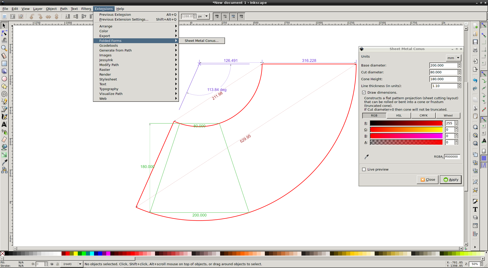

# **Sheet Metal Cone**

This extensions draws the 2D shape which is required to form a 3D cone 
(or truncated cone) after it's cut out (of whatever material). 

It can be used to generate a sheet cutting layout for a (truncated) cone.
The extension unfolds a frustum (=truncated cone) or a cone (if cut diameter=0)
and generates a sheet cutting layout or flat pattern projection that can 
be rolled or bend up into a (truncated) cone shape.  

## Installation

Copy the two files ***sheet_metal_conus.inx*** and ***sheet_metal_conus.py*** into the extensions folder:
The exact folder is indicated in: *"Edit -> Preferences -> System: User extensions"*

Generally the extension folder can be found here:

*`-> Linux:`*
*  ~/.config/inkscape/extensions/
*  /usr/share/inkscape/extensions/

*`-> Windows:`* 
*  type the following into the address line on a File Browser window:
*  %appdata%/inkscape/extensions

*`-> Mac OS X:`* 
*  /Applications/Inkscape.app/Contents/Resources/share/inkscape/extensions/

The menu entry for this this extension can be found under: _"Extensions->Folded Forms->Sheet Metal Conus..."_

## License

Distributed under the GNU LGPL v.3.0.

## References

* https://github.com/quirxi/SheetMetalCone/
* http://www.quirxi.net/code/python/sheet_metal_cone/overview.html
* https://inkscape.org/en/~quirxi/%E2%98%85sheet-metal-cone+0
* http://wiki.inkscape.org/wiki/index.php/Extension_repository#Sheet_Metal_Cone
* https://hobbyutil.googlecode.com/files/LayingOutFrustumWithDividers_20Jul2012.pdf

## Authors:

* quirxi (https://github.com/quirxi)
* Neon22 (https://github.com/Neon22) 
